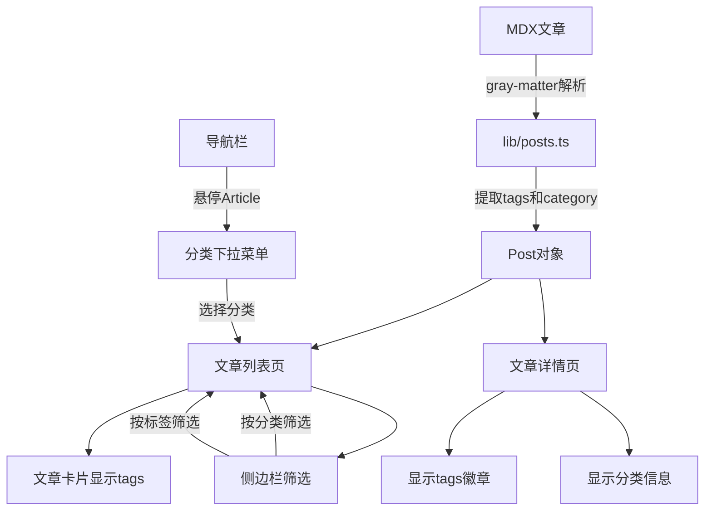

# 博客标签和分类功能实现方案

## 📋 需求概述

### 1. 标签功能（Tags）
- 支持在 MDX 文章的 frontmatter 中添加**多个标签**
- 标签在文章预览卡片和详情页显示
- 支持按标签筛选文章

### 2. 分类功能（Categories）
- 每篇文章有**单个分类**
- 导航栏 Article 悬停时显示分类下拉菜单
- 文章列表页侧边栏显示分类筛选
- 点击分类可查看该分类下的所有文章

---

## 🏗️ 技术架构

### 数据模型设计

```typescript
// types/post.ts
export interface BasePost {
  id: string;
  slug: string;
  title: string;
  description?: string;
  content: string;
  createdAt: string;
  image?: string;
  tags?: string[];        // 新增：标签数组
  category?: string;      // 新增：单个分类
}
```

### MDX Frontmatter 示例

```yaml
---
title: 卷不动了，然后呢？我与"优绩主义"和解的这三年
description: 从"优绩主义宠儿"到掉队者...
createdAt: 2026-02-09
category: 生活随笔
tags: [个人成长, 心理学, 反思, 优绩主义]
---
```

---

## 📐 系统架构图



---

## 🔧 实现步骤

### 步骤 1: 更新类型定义

**文件**: [`types/post.ts`](types/post.ts)

```typescript
export interface BasePost {
  id: string;
  slug: string;
  title: string;
  description?: string;
  content: string;
  createdAt: string;
  image?: string;
  tags?: string[];        // 新增
  category?: string;      // 新增
}
```

---

### 步骤 2: 修改文章解析逻辑

**文件**: [`lib/posts.ts`](lib/posts.ts)

需要修改的函数：
- `getAllPosts()` - 解析 tags 和 category
- `getPostBySlug()` - 解析 tags 和 category

新增工具函数：
- `getAllCategories()` - 获取所有唯一分类
- `getAllTags()` - 获取所有唯一标签
- `getPostsByCategory(category: string)` - 按分类筛选
- `getPostsByTag(tag: string)` - 按标签筛选

```typescript
// 示例实现
export function getAllCategories(): string[] {
  const posts = getAllPosts();
  const categories = new Set<string>();
  posts.forEach(post => {
    if (post.category) categories.add(post.category);
  });
  return Array.from(categories).sort();
}

export function getAllTags(): string[] {
  const posts = getAllPosts();
  const tags = new Set<string>();
  posts.forEach(post => {
    post.tags?.forEach(tag => tags.add(tag));
  });
  return Array.from(tags).sort();
}

export function getPostsByCategory(category: string): BasePost[] {
  return getAllPosts().filter(post => post.category === category);
}

export function getPostsByTag(tag: string): BasePost[] {
  return getAllPosts().filter(post => post.tags?.includes(tag));
}
```

---

### 步骤 3: 安装 shadcn/ui 组件

需要安装的组件：
- **NavigationMenu** - 用于导航栏下拉菜单
- **Badge** - 用于显示标签徽章

```bash
npx shadcn@latest add navigation-menu
npx shadcn@latest add badge
```

---

### 步骤 4: 创建导航栏分类下拉菜单

**文件**: `components/ui/category-nav-menu.tsx` (新建)

功能：
- 鼠标悬停在 "Article" 上时显示下拉菜单
- 列出所有分类选项
- 点击分类跳转到 `/article?category=分类名`

```typescript
// 伪代码示例
<NavigationMenu>
  <NavigationMenuList>
    <NavigationMenuItem>
      <NavigationMenuTrigger>Article</NavigationMenuTrigger>
      <NavigationMenuContent>
        <Link href="/article">全部文章</Link>
        {categories.map(category => (
          <Link href={`/article?category=${category}`}>
            {category}
          </Link>
        ))}
      </NavigationMenuContent>
    </NavigationMenuItem>
  </NavigationMenuList>
</NavigationMenu>
```

---

### 步骤 5: 更新布局导航栏

**文件**: [`app/layout.tsx`](app/layout.tsx:48)

将原来的简单链接替换为分类下拉菜单组件：

```typescript
// 修改前
<AnimatedNavLink href="/article">Article</AnimatedNavLink>

// 修改后
<CategoryNavMenu />
```

---

### 步骤 6: 更新文章列表页支持筛选

**文件**: [`app/article/page.tsx`](app/article/page.tsx)

功能：
- 支持 URL 参数 `?category=xxx` 和 `?tag=xxx`
- 根据参数筛选文章
- 显示当前筛选状态

```typescript
// 伪代码
export default function Article({ searchParams }) {
  const category = searchParams?.category;
  const tag = searchParams?.tag;
  
  let posts = getAllPosts();
  if (category) posts = getPostsByCategory(category);
  if (tag) posts = getPostsByTag(tag);
  
  return (
    <div className="flex">
      <aside>
        <FilterSidebar />
      </aside>
      <main>
        {/* 显示筛选后的文章 */}
      </main>
    </div>
  );
}
```

---

### 步骤 7: 创建侧边栏筛选组件

**文件**: `components/ui/filter-sidebar.tsx` (新建)

功能：
- 显示所有分类列表
- 显示所有标签列表
- 点击后更新 URL 参数进行筛选
- 高亮当前选中的分类/标签

布局示例：
```
┌─────────────────┐
│ 分类筛选        │
│ ○ 全部          │
│ ● 生活随笔      │
│ ○ 技术文章      │
│                 │
│ 标签筛选        │
│ #个人成长       │
│ #心理学         │
│ #反思           │
└─────────────────┘
```

---

### 步骤 8: 创建标签徽章组件

**文件**: `components/ui/tag-badge.tsx` (新建)

功能：
- 美观地显示标签
- 可点击跳转到标签筛选页
- 支持不同颜色主题

```typescript
// 示例
<TagBadge tag="个人成长" href="/article?tag=个人成长" />
```

---

### 步骤 9: 更新文章卡片显示标签

**文件**: [`components/ui/animated-post-card.tsx`](components/ui/animated-post-card.tsx)

在卡片底部添加标签显示：

```typescript
<CardContent>
  <p className="line-clamp-2 text-sm text-muted-foreground">
    {children.description}
  </p>
  
  {/* 新增：标签显示 */}
  {children.tags && children.tags.length > 0 && (
    <div className="mt-3 flex flex-wrap gap-2">
      {children.tags.map(tag => (
        <TagBadge key={tag} tag={tag} />
      ))}
    </div>
  )}
  
  <p className="mt-2 text-right text-xs text-muted-foreground">
    {children.createdAt}
  </p>
</CardContent>
```

---

### 步骤 10: 更新文章详情页显示

**文件**: [`app/blog/[slug]/page.tsx`](app/blog/[slug]/page.tsx)

在文章标题下方显示分类和标签：

```typescript
<CardHeader>
  <CardTitle className="text-3xl">{post.title}</CardTitle>
  
  {/* 新增：分类和标签 */}
  <div className="flex items-center gap-4 text-sm text-muted-foreground">
    {post.category && (
      <span>分类: {post.category}</span>
    )}
    <span>{post.createdAt}</span>
  </div>
  
  {post.tags && post.tags.length > 0 && (
    <div className="flex flex-wrap gap-2 pt-2">
      {post.tags.map(tag => (
        <TagBadge key={tag} tag={tag} />
      ))}
    </div>
  )}
</CardHeader>
```

---

### 步骤 11: 为现有文章添加示例数据

更新现有 MDX 文件的 frontmatter：

**[`content/posts/meritocracy.mdx`](content/posts/meritocracy.mdx)**
```yaml
---
title: 卷不动了，然后呢？我与"优绩主义"和解的这三年
description: ...
createdAt: 2026-02-09
category: 生活随笔
tags: [个人成长, 心理学, 反思, 优绩主义]
---
```

**[`content/posts/from-being-seen-to-living.mdx`](content/posts/from-being-seen-to-living.mdx)**
```yaml
---
title: 我没有战胜容貌焦虑，但我开始活了
createdAt: 2026-02-17
description: ...
slug: from-being-seen-to-living
category: 生活随笔
tags: [个人成长, 心理学, 容貌焦虑, 自我认知]
---
```

---

## 🎨 UI/UX 设计要点

### 1. 导航栏下拉菜单
- 悬停触发，流畅动画
- 清晰的视觉层次
- 支持键盘导航

### 2. 侧边栏筛选
- 固定在左侧或右侧
- 响应式设计（移动端可折叠）
- 清晰的选中状态

### 3. 标签徽章
- 使用 Badge 组件
- 柔和的背景色
- 悬停效果
- 可点击跳转

### 4. 筛选状态提示
- 显示当前筛选条件
- 提供"清除筛选"按钮
- 显示筛选结果数量

---

## 📱 响应式设计考虑

### 桌面端 (≥1024px)
- 侧边栏固定显示
- 导航栏下拉菜单完整展示

### 平板端 (768px - 1023px)
- 侧边栏可折叠
- 导航栏下拉菜单适配

### 移动端 (<768px)
- 侧边栏改为抽屉式
- 导航栏使用汉堡菜单
- 标签徽章自动换行

---

## 🔍 SEO 优化建议

1. **分类页面 URL 结构**
   - `/article?category=生活随笔` 或
   - `/article/category/生活随笔`

2. **标签页面 URL 结构**
   - `/article?tag=个人成长` 或
   - `/article/tag/个人成长`

3. **Meta 标签优化**
   - 为分类/标签页面生成独特的 title 和 description
   - 添加 canonical URL

4. **结构化数据**
   - 使用 JSON-LD 标记文章的分类和标签

---

## 🧪 测试清单

- [ ] 文章 frontmatter 正确解析 tags 和 category
- [ ] 导航栏下拉菜单正常显示所有分类
- [ ] 点击分类能正确筛选文章
- [ ] 侧边栏显示所有分类和标签
- [ ] 点击标签能正确筛选文章
- [ ] 文章卡片正确显示标签
- [ ] 文章详情页正确显示分类和标签
- [ ] URL 参数筛选功能正常
- [ ] 响应式布局在各设备正常显示
- [ ] 无分类/标签的文章不报错

---

## 🚀 未来扩展建议

1. **标签云**
   - 根据标签使用频率调整字体大小
   - 可视化展示热门标签

2. **相关文章推荐**
   - 基于相同标签推荐相关文章
   - 在文章详情页底部显示

3. **分类/标签统计**
   - 显示每个分类/标签的文章数量
   - 添加趋势分析

4. **搜索功能集成**
   - 支持按标签和分类搜索
   - 组合筛选（分类 + 标签）

5. **RSS 订阅**
   - 为每个分类生成独立 RSS
   - 为每个标签生成独立 RSS

---

## 📦 需要安装的依赖

```bash
# shadcn/ui 组件
npx shadcn@latest add navigation-menu
npx shadcn@latest add badge
```

---

## 📝 文件清单

### 需要修改的文件
- [`types/post.ts`](types/post.ts) - 添加 tags 和 category 字段
- [`lib/posts.ts`](lib/posts.ts) - 添加解析和筛选函数
- [`app/layout.tsx`](app/layout.tsx) - 更新导航栏
- [`app/article/page.tsx`](app/article/page.tsx) - 添加筛选逻辑
- [`components/ui/animated-post-card.tsx`](components/ui/animated-post-card.tsx) - 显示标签
- [`app/blog/[slug]/page.tsx`](app/blog/[slug]/page.tsx) - 显示分类和标签
- [`content/posts/meritocracy.mdx`](content/posts/meritocracy.mdx) - 添加示例数据
- [`content/posts/from-being-seen-to-living.mdx`](content/posts/from-being-seen-to-living.mdx) - 添加示例数据

### 需要创建的文件
- `components/ui/category-nav-menu.tsx` - 分类导航菜单
- `components/ui/filter-sidebar.tsx` - 筛选侧边栏
- `components/ui/tag-badge.tsx` - 标签徽章组件
- `components/ui/navigation-menu.tsx` - shadcn/ui 组件
- `components/ui/badge.tsx` - shadcn/ui 组件

---

## ⏱️ 实施建议

建议按以下顺序实施，每个阶段都可以独立测试：

**阶段 1: 数据层** (步骤 1-2)
- 更新类型定义
- 修改文章解析逻辑
- 添加工具函数

**阶段 2: 基础显示** (步骤 8-10)
- 创建标签徽章组件
- 在文章卡片和详情页显示标签

**阶段 3: 导航功能** (步骤 3-5)
- 安装 shadcn/ui 组件
- 创建导航栏下拉菜单
- 更新布局

**阶段 4: 筛选功能** (步骤 6-7)
- 更新文章列表页
- 创建侧边栏筛选组件

**阶段 5: 完善和测试** (步骤 11-12)
- 添加示例数据
- 全面测试

---

这个方案提供了完整的标签和分类功能实现路径。您对这个方案满意吗？是否需要调整某些部分？
